## Plans

### Free Plan

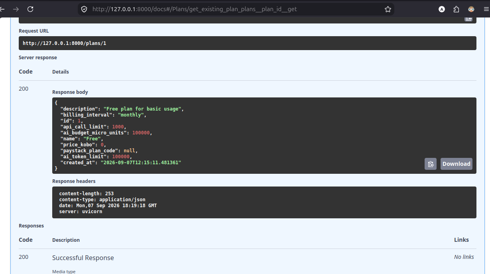

This screenshot shows that the Free plan was successfully seeded and can be retrieved from the database.

### Pro Plan

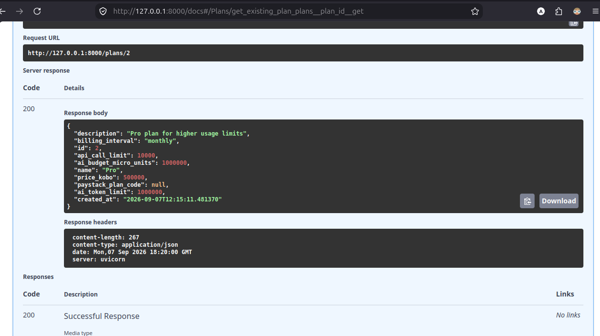

This screenshot shows that the Pro plan was successfully seeded and can be retrieved from the database.

## Tenant

### Tenant Creation

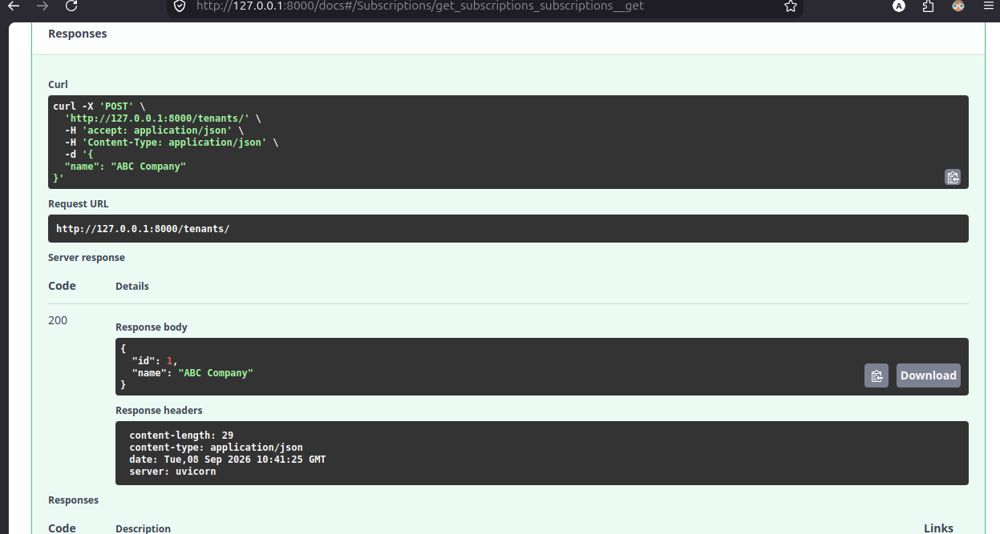

This screenshot shows a tenant being successfully created through the tenant endpoint.

### Automatic Free Subscription

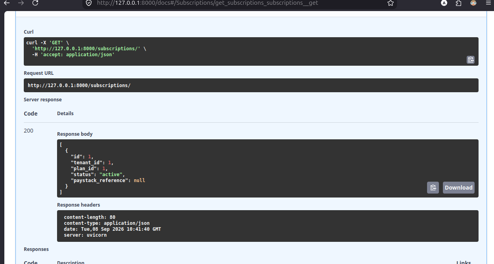

This screenshot shows that creating a tenant automatically creates an active subscription using the Free plan.

### Get All Tenants

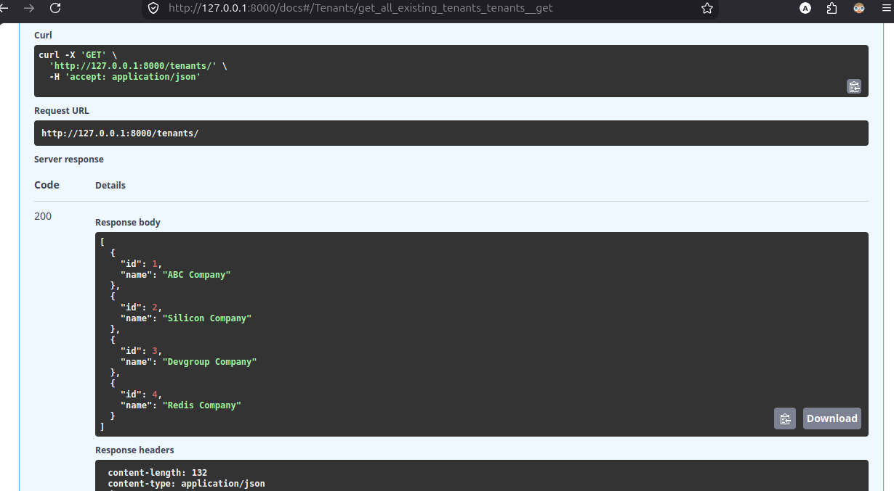

This screenshot shows the successful retrieval of tenants from the system.

##  Idempotency

The usage metering endpoint prevents the same billable action from being recorded more than once when a request is retried with the same idempotency key.

### Usage Before Retry

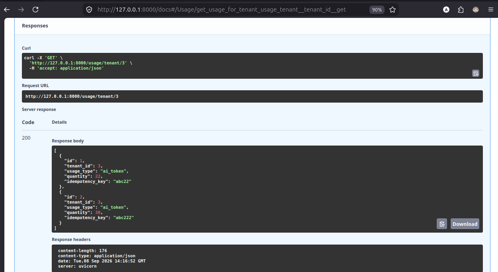

This screenshot shows the tenant's usage events before the retry request was sent.

### Repeated Request Using the Same Idempotency Key

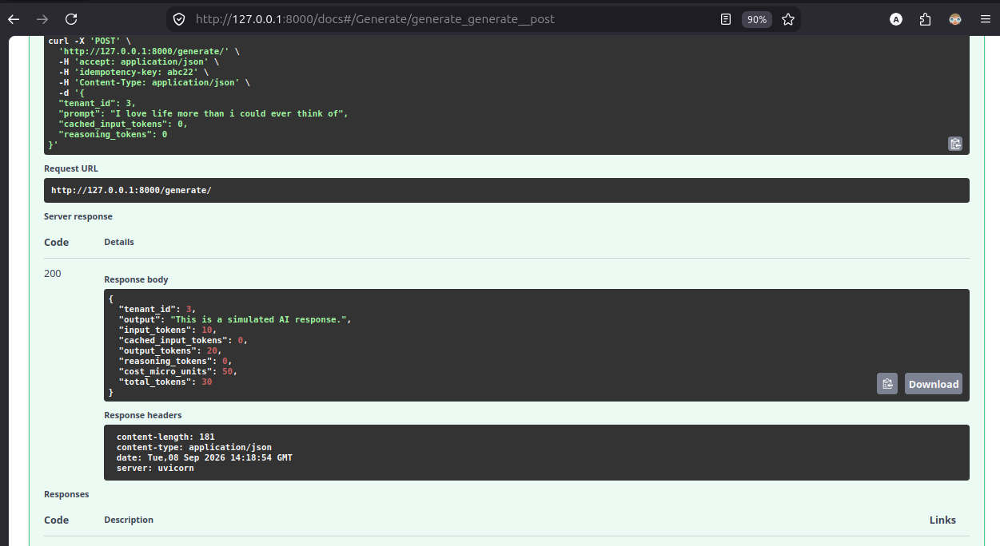

The same usage request is sent again using the existing idempotency key. The response heading/time confirms that this is a separate request from the initial usage check.

### Usage After Retry

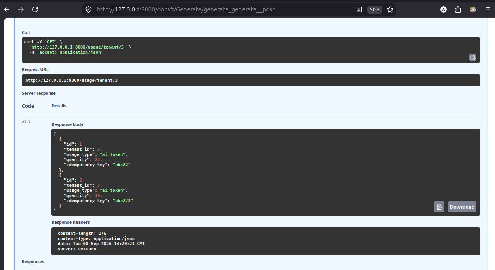

The usage events are checked again after the repeated request. The usage list remains unchanged, demonstrating that the repeated request did not create an additional usage event or increase the recorded usage.

## Quotas

### Quota Enforcement

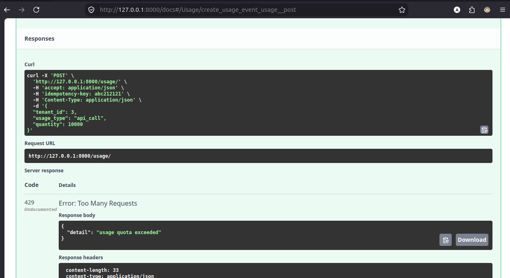

This screenshot shows a request being rejected after the tenant exceeds the usage quota defined by the active plan. The API returns the appropriate error response and explains that the usage quota has been exceeded.

## Payment 

The payment initialization endpoint prevents duplicate pending payments when the same initialization request is sent more than once.

### First Initialization Request

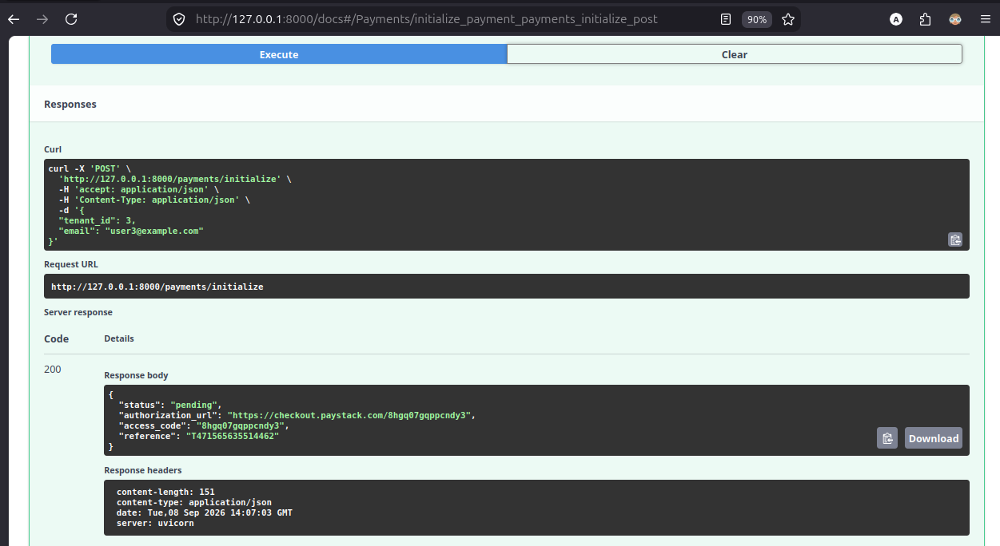

The first request initializes a new payment and returns a payment reference and authorization details.

### Second Initialization Request

The initialization request is sent again. The response heading/time confirms that this is a new request, while the payment reference remains the same. The existing pending payment is returned instead of creating another payment.

### Initialization After Payment

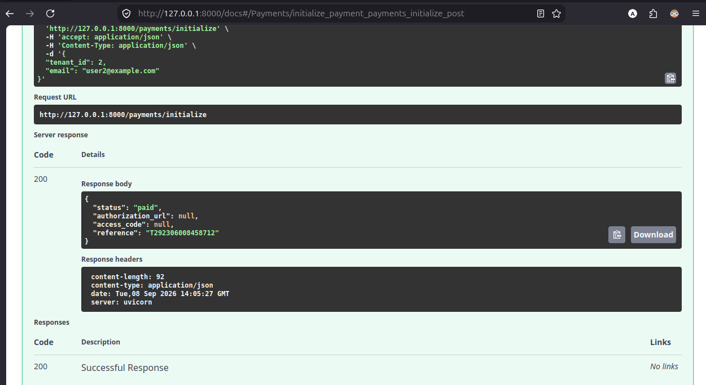

After the payment is completed, the initialization endpoint is called again. The system recognizes the existing paid payment and returns its paid status rather than creating a new payment.

### Payment Started

### Payment Successful

## Subscription

### Pending Subscription

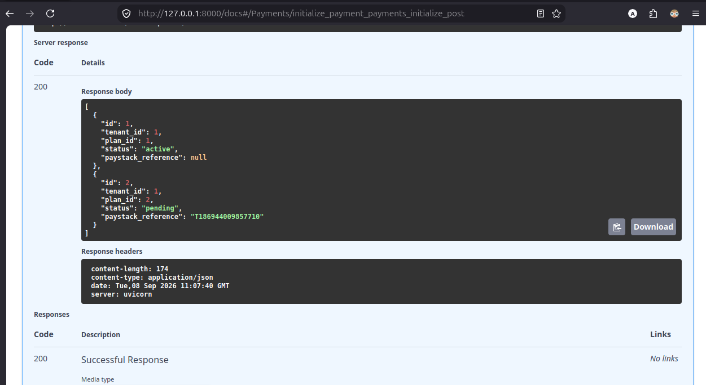

This screenshot shows a subscription in the **pending** state before successful payment.

### Active Subscription

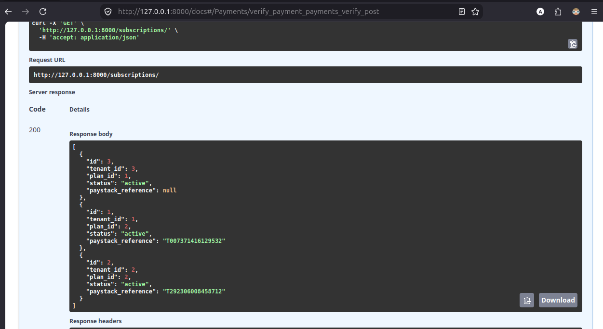

This screenshot shows the subscription becoming **active** after successful payment.

## Automated Tests

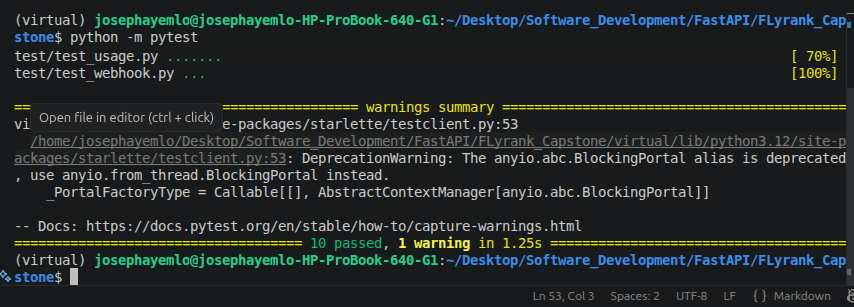

This screenshot shows the project's automated test suite being executed successfully with pytest.
